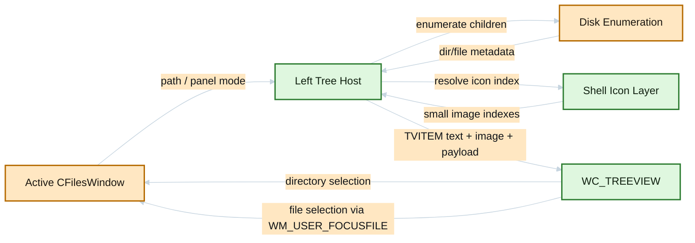
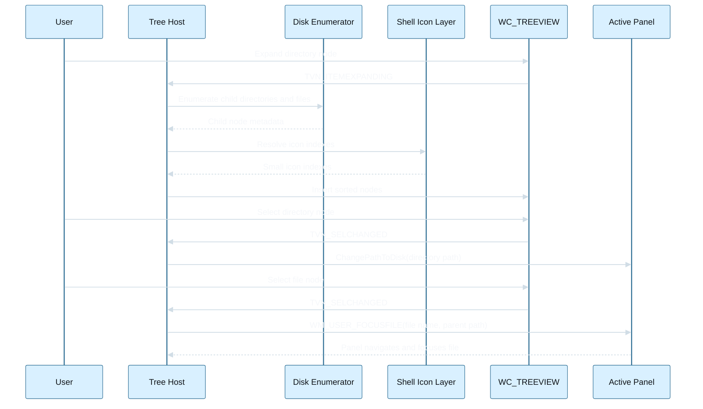

# Panel TreeView File Icons Design

## Recommended Design

Extend the existing left-hosted TreeView so each node can represent either a directory or a file, with icons coming from the same shell-oriented icon infrastructure already used elsewhere in Salamander.

The recommended shape is:

- keep the current left-side tree host and active-panel synchronization model unchanged
- extend tree population so directory expansions can append both child directories and child files
- attach a richer per-node payload that distinguishes directory nodes from file nodes
- use a TreeView image list backed by shell small icons so folders and file types look familiar
- keep directory-node navigation as it is today
- map file-node selection to existing panel focusing behavior instead of inventing a new file-open flow

This keeps the feature additive. It enriches the tree without redefining ownership, focus rules, or panel navigation semantics.

## Communication Diagram

## Sequence Diagram

## Existing Code Anchors

### Current tree infrastructure

- `src/fileswn1.cpp`: `RefreshTreeView()`, `PopulateTreeViewItem()`, and the current `InsertTreeViewItem()` path payload model
- `src/fileswn2.cpp`: TreeView host creation, splitter handling, theme setup, and active-panel source resolution
- `src/fileswnb.cpp`: TreeView notification handling, including `TVN_SELCHANGED`
- `src/fileswnd.h`: `HTreeView`, `RefreshTreeView()`, `PopulateTreeViewItem()`, and tree-related panel state

### Tree image-list usage patterns

- `src/dialogs5.cpp`: dialog-side `TreeView_SetImageList(...)` lifecycle and safe `ImageList_Destroy(...)` teardown
- `src/translator/wndtree.cpp`: additional TreeView image-list usage pattern

### File and shell icon infrastructure

- `src/geticon.cpp`: `GetFileIcon(...)` and shell-image-list retrieval via `SHGetFileInfo(...)`
- `src/shiconov.cpp`: shell overlay support and shell icon helper wrapper behavior
- `src/fileswn1.cpp`: existing icon-reader and shell-icon behavior used by panels

### File focusing behavior

- `src/consts.h`: `WM_USER_FOCUSFILE`
- `src/fileswnb.cpp`: handling of `WM_USER_FOCUSFILE`
- `src/mainwnd4.cpp`: `PostFocusNameInPanel(...)`

## Node Model

The current tree stores only a duplicated full path in `TVITEM.lParam`. That is enough for directory-only navigation, but not ideal once file nodes are added.

Recommended replacement:

- introduce a small heap-allocated tree node payload
- store one payload per node in `TVITEM.lParam`
- free payloads during tree cleanup and item destruction

Recommended fields:

- `NodeType`: directory or file
- `FullPath`: full file-system path
- `ParentPath`: optional cached parent path for file nodes
- `DisplayName`: node label when needed
- `ShellIconIndex`: small icon index for normal state
- `ShellOpenIconIndex`: optional open-folder selected icon for directories
- `HasEnumeratedChildren`: guard to avoid repeated work when expanding

This removes the ambiguity that currently comes from storing only a path string and trying to infer node semantics later.

## Icon Strategy

## Preferred approach

Bind the TreeView to the shell small image list and set image indexes per node.

Why this is the best fit:

- Salamander already uses shell icon infrastructure
- file-type icons are already a solved problem in the repo
- TreeView naturally works with image indexes
- the result will look familiar to Windows users and pleasant enough without inventing a new icon theme subsystem

## Directory icons

For directory nodes:

- use a closed-folder icon for `iImage`
- use an open-folder icon for `iSelectedImage` when available
- keep `cChildren` semantics based on child-directory existence, not file existence alone

This preserves standard TreeView affordance: expandability should mean the node has navigable child hierarchy.

## File icons

For file nodes:

- use a small icon index resolved from the full path when available
- fall back to extension-based or generic document icons if the path-based resolution fails
- treat file nodes as leaves with `cChildren = 0`

## Overlay handling

Recommended MVP:

- do not explicitly add custom shell overlays in the first iteration
- accept whatever falls out naturally from the chosen shell icon lookup, if any
- defer dedicated overlay fidelity until the base mixed tree is proven usable

Reasoning:

- overlays add cost, complexity, and visual noise
- the first value is folder/file recognition, not overlay parity with the panel list

## Population Strategy

## Current behavior

`PopulateTreeViewItem()` currently:

- enumerates disk children with `FindFirstFile`
- inserts only directories
- sorts children after insertion

## Proposed behavior

When expanding a directory node:

1. Enumerate children with `FindFirstFile`.
2. Split results into directories and files.
3. Skip `.` and `..`.
4. Resolve the small icon index for each visible child.
5. Insert directories first.
6. Insert files after directories.
7. Sort within each group if needed, or preserve insertion order based on a stable compare.

Recommended MVP ordering:

- directories first
- then files
- alphabetical, case-insensitive, inside each group

This gives the user a predictable locator tree and keeps folders visually dominant.

## Visibility rules

Recommended MVP rule set:

- honor the same hidden/system visibility baseline as the active panel configuration
- do not attempt full parity with every advanced mask/filter rule in the first iteration

Reasoning:

- hidden/system visibility is easy to explain and materially important
- advanced panel filters are dynamic and much more coupled to panel-list logic
- full filter parity can be added later if users actually need it

## Selection Behavior

## Directory nodes

Keep current behavior:

- selection changes the active panel path through `ChangePathToDisk(...)`

## File nodes

Use the existing file-focus flow:

- send `WM_USER_FOCUSFILE` to the active panel, passing file name and parent path
- let the panel navigate if needed and focus/select the file using its existing mechanisms

Why this is the right integration point:

- it already exists
- it preserves the active panel as the source of truth
- it avoids duplicating panel file-selection logic inside the tree host

Recommended MVP behavior:

- single selection on a file node locates and focuses the file in the active panel
- Enter and double click on a file node should not yet launch the file unless the existing panel-default action is intentionally reused in a later step

## Performance Strategy

The main risks are icon lookup cost and large directory fan-out.

Recommended mitigations:

- populate children lazily on expand, not recursively
- use shell small image list indexes instead of creating per-node `HICON` objects
- cache node icon indexes in payloads after the first resolution
- avoid overlays and thumbnails in MVP
- keep file-node insertion scoped to expanded directories only

If large folders become expensive:

- introduce an upper bound or deferred batching later
- but do not complicate MVP until real usage shows the need

## Refresh Model

The tree already refreshes on:

- active panel changes
- active path changes
- tree-driven navigation

For file-icon trees, the same refresh triggers remain valid, but now a repopulation must also account for:

- file create/delete/rename
- folder content changes while expanded

Recommended MVP:

- reuse the current full subtree refresh behavior when the tracked path changes
- do not attempt incremental in-place node patching in the first iteration

## Non-disk Behavior

Keep the current non-disk rule:

- only disk paths get the rich mixed tree
- archive and plugin-FS states remain empty or disabled

This feature should not silently broaden the support matrix.

## Risks

- mixed directory/file trees can become noisy if icon quality or ordering is poor
- shell icon lookup may be slower than directory-only population in large folders
- keeping file visibility aligned with panel expectations can become confusing if filter parity is partial
- incorrect payload lifetime management can leak memory or leave stale `lParam` pointers
- file-node selection must not steal workflow control from the panel or trigger accidental opens

## Recommended MVP Decision

Implement a mixed tree for disk paths only, with:

- directories first
- files as leaf nodes
- shell small icons per node
- directory selection via `ChangePathToDisk(...)`
- file selection via `WM_USER_FOCUSFILE`
- no thumbnails
- no dedicated overlay fidelity yet

This is the highest-value, lowest-regret version of the feature for the current codebase.
