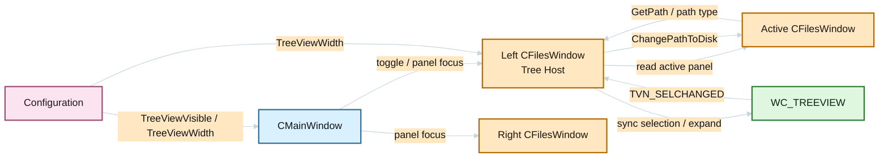
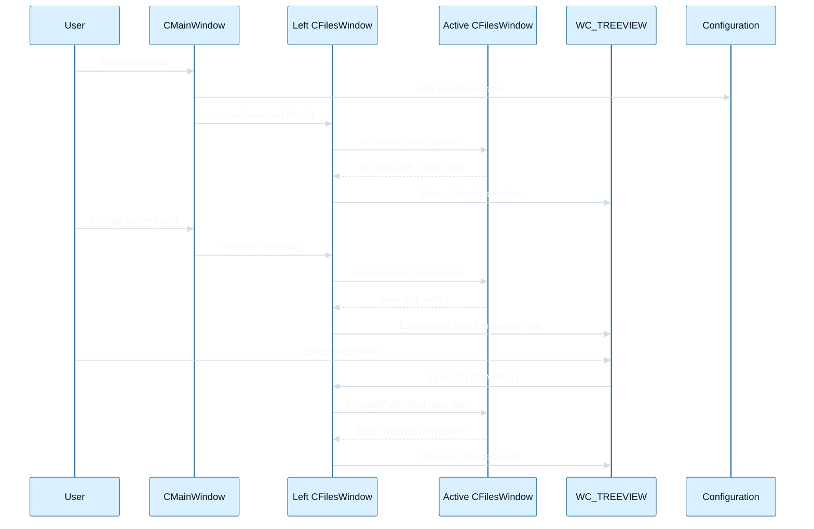

# Panel TreeView Design

## Recommended Design

Implement the tree as a panel-owned child control hosted only by the left `CFilesWindow`, while its content mirrors whichever panel is currently active.

Reasoning:

- `CMainWindow` already owns top-level positioning of the left and right panels and split bar.
- `CFilesWindow` already owns panel-internal composition such as directory line, header line, status line, and list box.
- The requirement is hybrid: the tree must stay visually fixed on the left side, but it must reflect the active panel path. A left-panel host with active-panel synchronization satisfies both constraints with limited surface area.

The least risky design is therefore:

- add TreeView support to `CFilesWindow`
- host the TreeView and splitter only in the left panel
- use the active panel as the data source for path synchronization and navigation
- use shared persisted settings for visibility and width

## Communication Diagram

## Sequence Diagram

## Existing Code Anchors

### Visibility toggle pattern

- `src/mainwnd1.cpp`: toggle methods such as `ToggleTopToolBar()` and `ToggleDriveBar()`
- `src/mainwnd2.cpp`: load/save of persisted visibility flags
- `src/mainwnd3.cpp`: `WM_COMMAND` handling for toggle commands and checked-state updates in `CML_OPTIONS_VISIBLE`
- `src/menu4.cpp`: menu entries under `Options > Visible`
- `src/resource.rh2`: command identifiers for toggle commands
- `src/dialogs5.cpp` and `src/cfgdlg.h`: configuration pages where a persisted checkbox can be exposed

### Fixed accelerator pattern

- `src/salamand.rc`: `IDA_MAINACCELS1` and `IDA_MAINACCELS2`
- `src/salamdr1.cpp`: accelerator tables are loaded through `LoadAccelerators(...)`

### TreeView implementation examples

- `src/dialogs5.cpp`: `CMyTreeView` and TreeView control usage in configuration UI
- `src/common/sheets.cpp`: themed `WC_TREEVIEW` usage
- `src/translator/wndtree.cpp` and `src/translator/wndtree.h`: stronger reusable TreeView window patterns

### Active-panel synchronization

- `src/mainwnd4.cpp`: `ChangePanel()` and `FocusPanel()`
- `src/mainwnd.h`: `GetActivePanel()` and `SetActivePanel()`
- `src/toolbar6.cpp`: drive bar logic already mirrors the active panel

### Panel path and layout hooks

- `src/fileswnd.h`: `GetPath()`, `ChangePathToDisk()`, `ChangePathToArchive()`, `ChangePathToPluginFS()`, `RefreshForConfig()`, `LayoutListBoxChilds()`
- `src/fileswn0.cpp`: `LayoutListBoxChilds()`
- `src/fileswn1.cpp`: directory line updates
- `src/fileswn0.cpp` and related `fileswn*.cpp`: panel keyboard and path-changing flows

## Proposed Additions

### New persisted configuration

- `Configuration.TreeViewVisible`
- `Configuration.TreeViewWidth`

The visible flag follows the same persistence model as other bars. Width should be stored separately so the pane can restore to the last size instead of reopening with a hardcoded default every time.

### New command

- `CM_TOGGLETREEVIEW`

Integration points:

- define the command in `src/resource.rh2`
- add the menu item in `src/menu4.cpp` under `CML_OPTIONS_VISIBLE`
- handle the command in `src/mainwnd3.cpp`
- reflect checked state in the `CML_OPTIONS_VISIBLE` popup update logic
- add a fixed accelerator entry in `src/salamand.rc`
- add a checkbox on the Panels configuration page in `src/dialogs5.cpp` and the related dialog resources

### New panel members

Add panel-owned state to `CFilesWindow`, for example:

- `HWND HTreeView`
- `HWND HTreeSplit`
- `BOOL TreeHostVisible`
- `int TreeWidth`
- lightweight state needed to suppress recursive navigation while syncing selection
- drag state for splitter interaction

The exact wrapper type can be a raw Win32 control or a small helper class such as `CDirectoryTreePane`.

## Layout Strategy

### Preferred approach

Reserve a vertical strip inside the left `CFilesWindow` and place the tree plus splitter there. The remaining panel width continues to be used by the file list and existing child controls.

This should be driven from panel-local layout code rather than from main-window split calculations.

### Why not a global pane?

A single main-window-owned tree would need special handling across:

- split changes
- zoomed panel mode
- drag-resize of the panel divider
- active-panel switching
- hit testing and focus routing between two panels and one extra peer window

That is more invasive than reusing the existing panel containment model.

## Synchronization Model

### On active panel change

Hook `ChangePanel()` and `FocusPanel()` in `src/mainwnd4.cpp` so that when the active panel changes:

- left panel keeps its tree host alive if the feature is enabled
- left panel rebinds the tree content to the newly active panel
- tree selection expands to the active panel path

### On active panel path change

Whenever the active panel changes directory through standard flows, refresh the tree selection from the panel path.

Candidate paths include:

- drive changes
- directory line navigation
- history navigation
- tree-driven navigation itself
- other direct calls to `ChangePathToDisk()`

The implementation should centralize this in one helper instead of scattering TreeView updates into many unrelated branches.

### On width changes

The splitter lives next to the tree host in the left panel and updates `Configuration.TreeViewWidth` during drag. Panel layout then reflows using the persisted width, so restart behavior matches the last user adjustment.

## Non-disk Behavior

MVP behavior for archive and plugin FS should be explicit:

- keep the left-side pane visible if the global feature is enabled
- disable the tree and show no hierarchy, or show a concise placeholder message if a companion static control is added

This avoids fake nodes and prevents the tree from implying support that does not exist.

## Suggested Control Flow

1. User triggers `CM_TOGGLETREEVIEW`.
2. Main window flips `Configuration.TreeViewVisible`, persists it through the existing save path, and requests relayout/refresh.
3. Left `CFilesWindow` creates or shows its tree host and splitter.
4. Left panel resolves the active panel and syncs tree expansion and selection from that panel `GetPath()`.
5. User selects a node in the tree.
6. Tree handler asks the active panel to navigate using existing disk-path logic.
7. After navigation completes, the left tree host re-syncs from the final active-panel path.

## Risks

- Recursive updates if tree selection triggers path change and path change triggers tree reselection.
- Performance cost when expanding large directories or UNC roots.
- Legacy path handling differences between disk, UNC, archive, and plugin FS modes.
- Focus bugs if the tree accidentally steals focus during activation changes.
- Splitter hit testing and minimum width rules may feel wrong if not clamped carefully.

## Recommended Implementation Order

1. Add command, menu item, persisted config flag, and fixed accelerator.
2. Add left-panel tree host creation/destruction and width persistence.
3. Sync tree content with active-panel changes.
4. Sync tree selection from active-panel path.
5. Add navigation from tree selection back into active-panel path changes.
6. Handle non-disk states, splitter drag, and error paths.

## Recommended MVP Decision

Use a fixed built-in shortcut plus persisted visibility, and defer user-configurable hotkeys. The repository already supports the former cleanly, while the latter would introduce a new core capability with broader UI and persistence impact than the tree feature itself.
