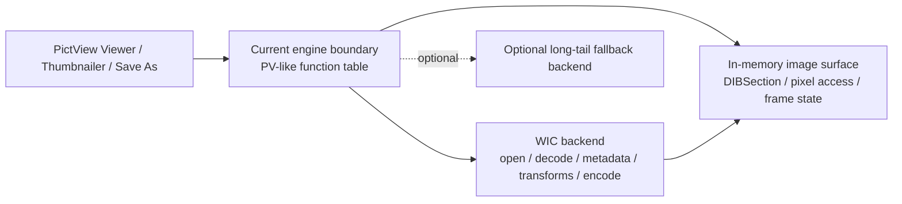

# PictView Engine Replacement Design

**Spec**: `.specs/features/pictview-engine-replacement/spec.md`
**Status**: Draft

---

## Architecture Overview

The recommended path is to replace the proprietary engine with an in-repo open backend while preserving the current engine boundary as the migration seam.

That means:

- do not wire WIC directly across the whole viewer first
- keep the current engine-style contract concentrated in one place
- implement that contract with a new native backend
- use WIC as the primary decoder/encoder/metadata/transform pipeline for the MVP
- keep room for an optional second backend later if long-tail formats are required

---

## Why This Path

The existing code already centralizes the proprietary dependency behind a compact function table loaded in `LoadPictViewDll()` and consumed throughout the plugin. Reusing that seam is lower-risk than pushing COM/WIC types into every viewer, thumbnail, and save path at once.

This also gives a clean opportunity to eliminate the current x64 IPC bridge, which exists only because the proprietary binary is 32-bit.

---

## Code Reuse Analysis

### Existing Components to Leverage

| Component | Location | How to Use |
| --- | --- | --- |
| PictView engine boundary | `src/plugins/pictview/pictview.cpp` | Keep as the migration seam; redirect it to an open implementation instead of a closed DLL |
| Viewer shell and renderer | `src/plugins/pictview/render1.cpp` and `src/plugins/pictview/render2.cpp` | Reuse as-is as much as possible; feed it compatible image handles and metadata |
| Thumbnail pipeline | `src/plugins/pictview/thumbs.cpp` and `src/plugins/pictview/Thumbnailer.cpp` | Reuse current flow; reimplement image-open/save/thumbnail operations behind the backend |
| Save-as UI | `src/plugins/pictview/saveas.cpp` | Reuse UI and decision flow; replace capability queries and encoding calls |
| EXIF module | `src/plugins/pictview/exif/` and `src/plugins/pictview/dialogs.cpp` | Keep existing dialog behavior initially; optionally reduce dependency on the separate EXIF DLL later |
| WIA/TWAIN integration | `src/plugins/pictview/wiawrap.cpp` and `src/plugins/pictview/pvtwain.cpp` | Preserve current capture/scan integration; adapt only the image object creation path if needed |

### Integration Points

| System | Integration Method |
| --- | --- |
| Viewer painting | Convert backend output into DIB-backed pixel buffers compatible with existing GDI painting |
| Clipboard | Create backend images from CF_DIB/CF_BITMAP and expose them through the same viewer path |
| Save-as | Replace `PVIsOutCombSupported` and `PVSaveImage` with backend capability and encode calls |
| EXIF / metadata | Use WIC metadata readers for orientation and common tags; keep existing EXIF dialog code until a second pass |

---

## Current Reality Anchors

- The repo explicitly says the proprietary engine was removed for GPL reasons and calls out WIC as the likely replacement candidate.
- The plugin currently hard-loads `PVW32Cnv.dll` and resolves a fixed set of engine entry points.
- The plugin advertises itself as viewer, converter, and thumbnailer with more than 60 historical formats, so a WIC-only MVP is functional but not full legacy parity.
- x64 currently goes through `salpvenv.exe` only to reach the old 32-bit proprietary DLL.

---

## Components

### Open Image Engine

- **Purpose**: Provide an in-repo open replacement for the proprietary engine contract currently consumed by PictView.
- **Location**: `src/plugins/pictview/engine/` or equivalent new folder.
- **Interfaces**:
  - `OpenImage(...)` - open file, memory image, or clipboard image
  - `GetImageInfo(...)` - expose width, height, frame count, flags, color model, metadata flags
  - `ReadFrame(...)` - decode frame pixels into an internal surface
  - `DrawImage(...)` - provide rendering-compatible output to the existing viewer
  - `SaveImage(...)` - encode to supported output formats
  - `TransformImage(...)` - rotate, flip, crop, stretch
  - `GetPixelAccess(...)` - expose pixel reads needed by histogram and pipette tools
- **Dependencies**: WIC, COM, GDI / DIBSection helpers.
- **Reuses**: Existing call patterns from `PVW32DLL`.

### WIC Backend

- **Purpose**: Implement the MVP backend using WIC decoders, encoders, metadata readers, and transform pipeline components.
- **Location**: `src/plugins/pictview/engine/wic/`
- **Interfaces**:
  - `CreateDecoderFromFilename(...)`
  - `GetFrame(index)`
  - `BuildTransformPipeline(...)`
  - `CopyPixels(...)`
  - `WriteFrame(...)`
- **Dependencies**: `IWICImagingFactory`, decoders, encoders, metadata query APIs, scaler / clipper / flip-rotator.
- **Reuses**: Current viewer state, current EXIF-driven autorotate expectations.

### Image Surface / Handle

- **Purpose**: Hold decoded frame state, metadata flags, transform state, and pixel buffers in a form compatible with the current renderer and histogram code.
- **Location**: `src/plugins/pictview/engine/`
- **Interfaces**:
  - `GetFrameInfo()`
  - `EnsureDecoded()`
  - `GetDibSection()`
  - `CopyRegion()`
  - `GetPixel(x, y)`
- **Dependencies**: WIC backend and GDI objects.
- **Reuses**: Existing histogram, pipette, and renderer workflows.

### Capability Mapper

- **Purpose**: Translate backend codec support into the PictView concepts currently used by `saveas.cpp` and thumbnail code.
- **Location**: `src/plugins/pictview/engine/`
- **Interfaces**:
  - `IsOutputCombinationSupported(format, compression, colors, colorModel)`
  - `EnumerateReadableFormats()`
  - `EnumerateWritableFormats()`
- **Dependencies**: Backend capability discovery.
- **Reuses**: Existing save-as UI and filter logic.

---

## Recommended MVP Format Scope

### Read / view / thumbnail

Use WIC for the formats the platform already covers well:

- BMP
- GIF
- ICO
- JPEG
- PNG
- TIFF
- DDS
- JPEG XR

Optionally support more through Microsoft-provided WIC codecs already recognized by WIC:

- Raw image extensions
- WebP extension
- HEIF extension

### Save-as

Start with the WIC-native encoders:

- BMP
- GIF
- JPEG
- PNG
- TIFF
- JPEG XR
- DDS if worth exposing

Do not promise historical save targets like `PCX`, `TGA`, `PNM`, `RAS`, `RGB`, `RLE`, `CEL`, or `SKA` in the MVP unless a second backend is added.

---

## Technology Decision

### Primary recommendation: WIC-first backend

**Why**

- Native to Windows and already aligned with a Win32 desktop plugin.
- No new third-party runtime is required for the core path.
- Official support covers common formats, metadata, frames, thumbnails, and transform pipelines.
- Extensible codec model lets Salamander benefit from installed codecs later.
- Lets the project drop the current 32-bit proprietary bridge on x64.

**Tradeoff**

- WIC does not restore the plugin's historical 60+ format breadth by itself.
- Several legacy save targets disappear unless backed by another library.
- Some niche formats depend on Microsoft Store codec packages or third-party WIC codecs.

### Secondary option if long-tail parity becomes mandatory: ImageMagick fallback backend

**Why**

- Officially supports reading over 100 major formats.
- Covers many of the legacy formats that WIC does not.
- Has a GPLv3-compatible license and can live behind an optional fallback path.

**Tradeoff**

- Much heavier dependency and packaging story.
- Format support is often delegated to additional external libraries or programs.
- Larger security and maintenance surface than WIC.

### Not recommended as the primary path: FreeImage

**Why not**

- The project site currently shows its latest release as July 31, 2018.
- Dual-license terms are workable for GPL usage, but the project looks materially less active than WIC or ImageMagick.
- Choosing it as the main engine would reduce dependency count less decisively than WIC while still adding an external image stack.

---

## Decision Matrix

| Decision | Choice | Rationale |
| --- | --- | --- |
| MVP backend | WIC | Best fit for Win32, open build, native transforms, metadata, and low dependency cost |
| Migration seam | Keep current engine boundary | Minimizes plugin churn and isolates backend work |
| x64 strategy | Native x64 backend, remove envelope dependency | The current IPC bridge exists only for the closed 32-bit DLL |
| EXIF strategy | Keep existing EXIF UI first, source orientation from WIC where possible | Preserves user-visible behavior while reducing scope |
| Legacy long-tail formats | Optional later fallback backend | Avoids blocking the MVP on 60+ format parity |

---

## Error Handling Strategy

| Error Scenario | Handling | User Impact |
| --- | --- | --- |
| Unsupported format | Return a normal unsupported-image error | User sees a clear format limitation instead of missing-DLL failure |
| Installed codec missing | Report format unsupported and keep plugin stable | Common formats still work; optional formats degrade gracefully |
| Metadata unavailable | Continue image display without EXIF-driven features | Viewer still opens image |
| Save target unsupported | Hide or disable unsupported targets in save-as | Avoids false promises and runtime failures |
| Large decode canceled | Use backend cancellation hooks where possible and preserve current progress UI | User can stop expensive operations |

---

## Implementation Phases

### Phase 1: Open backend seam

- introduce an internal open engine implementation
- redirect `LoadPictViewDll()` away from proprietary binary loading for open builds
- remove the requirement for `PVW32Cnv.lib` in the new path

### Phase 2: WIC MVP

- open / decode / draw common formats
- multi-frame support for GIF and TIFF where needed
- thumbnail generation
- clipboard image loading
- autorotate based on metadata
- save-as for WIC-native encoders

### Phase 3: Parity cleanup

- map save-as UI to actual backend capabilities
- remove obsolete x64 envelope assumptions
- tighten pixel access, histogram, and print paths

### Phase 4: Optional long-tail recovery

- add fallback backend for non-WIC legacy formats only if product value justifies it
- reintroduce selected historical save targets behind that backend
