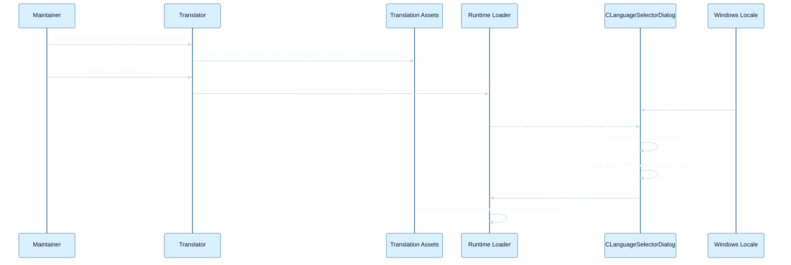

# Portuguese Localization Design

**Spec**: `.specs/features/portuguese-localization/spec.md`
**Status**: Draft

## Recommended Design

Implement Portuguese localization primarily as an asset-and-pipeline feature, not as a new runtime localization subsystem.

The current product already has the two runtime behaviors that matter most for this feature:

- language packs carry a concrete `LANGID`
- automatic selection already prefers exact locale match and then falls back to the primary language

That means the lowest-risk design is:

- create two independent Portuguese translation lines, one for `pt-BR` and one for `pt-PT`
- encode the distinction through the existing `LANGID` metadata in `.slt` and `.slg`
- let the current runtime selector continue to do exact-match and primary-language fallback
- limit code changes to places where repository automation, packaging, or display clarity are not yet variant-aware

This keeps the runtime model stable and concentrates the work in translation assets, Translator usage, and a small number of integration checks.

## Communication Diagram

```mermaid
%%{init: {'theme': 'base', 'themeVariables': { 'primaryColor': '#d9f0ff', 'primaryTextColor': '#101418', 'primaryBorderColor': '#2f6f95', 'secondaryColor': '#ffe7c2', 'secondaryTextColor': '#1a1610', 'secondaryBorderColor': '#b56a00', 'tertiaryColor': '#dff7df', 'tertiaryTextColor': '#102010', 'tertiaryBorderColor': '#2e7d32', 'lineColor': '#c7d5e0', 'textColor': '#f5f7fa', 'mainBkg': '#11161c', 'clusterBkg': '#182028', 'clusterBorder': '#7aa6c2' } } }%%
flowchart LR
    TA["Translation Assets\ntranslations/pt-br\ntranslations/pt-pt"] -->|"LANGID + metadata"| TR["Translator Workflow"]
    TR -->|"build / export"| SLG[".slg Language Modules"]
    SLG -->|"loaded from lang/*.slg"| RT["Runtime Language Loader"]
    RT -->|"CLanguage + VERSIONINFO"| LS["Language Selector"]
    OS["Windows UI Locale"] -->|"GetUserDefaultUILanguage()"| LS
    LS -->|"exact LANGID or PRIMARYLANGID fallback"| APP["Open Salamander UI"]

    classDef shell fill:#d9f0ff,stroke:#2f6f95,color:#101418,stroke-width:2px;
    classDef asset fill:#ffe7c2,stroke:#b56a00,color:#1a1610,stroke-width:2px;
    classDef control fill:#dff7df,stroke:#2e7d32,color:#102010,stroke-width:2px;
    classDef data fill:#fbe3ef,stroke:#9b4d72,color:#1f1520,stroke-width:2px;

    class RT,LS,APP shell;
    class TA,TR,SLG asset;
    class OS data;
```



## Sequence Diagram



## Existing Code Anchors

### Runtime language discovery and selection

- `src/dialogs2.cpp`: `CLanguageSelectorDialog::Initialize()` enumerates `lang\\*.slg`
- `src/dialogs2.cpp`: `CLanguageSelectorDialog::GetPreferredLanguageIndex()` already implements exact `LanguageID` match, then `PRIMARYLANGID(...)`, then English fallback
- `src/salamand.h`: `CLanguage` stores `FileName`, `LanguageID`, `AuthorW`, `Web`, `CommentW`, and `HelpDir`
- `src/salamdr2.cpp`: `CLanguage::Init(...)` reads translation metadata from the `.slg` `VERSIONINFO`
- `src/salamdr2.cpp`: `CLanguage::GetLanguageName(...)` derives the user-visible name from `GetLocaleInfo(..., LOCALE_SLANGUAGE, ...)`

### Translator metadata model

- `src/translator/trldata.h`: `CSLGSignature` defines `LanguageID`, `Author`, `Web`, `Comment`, `HelpDir`, and `SLGIncomplete`
- `src/translator/trldata.cpp`: export writes `LANGID`, `AUTHOR`, `WEB`, `COMMENT`, `HELPDIR`, and `SLGINCOMPLETE`
- `src/translator/trldata.cpp`: import reads the same fields back from `.slt`
- `src/translator/dialogs.cpp`: properties dialog already lets the maintainer choose the locale from enumerated Windows locales

### Repository translation layout

- `translations/*/*.slt`: current per-language, per-component archive pattern
- `translations/!update_langs_from_translator.bat`: generic copy logic is directory-driven and does not hardcode a fixed list of languages

### Packaging and follow-up integration points

- `src/plugins/zip/vcxproj/selfextr/sfxmake.bat`
- `src/plugins/zip/vcxproj/selfextr/makeall.bat`
- `src/plugins/zip/selfextr/language/*`

These ZIP self-extractor assets use explicit language lists and are likely follow-up work if Portuguese support is extended to that packaging surface.

## Design Principles

- Reuse `LANGID` as the single source of truth for Portuguese variant identity.
- Keep Portuguese variant resolution in the existing runtime selector instead of branching product logic by language name.
- Prefer repository and packaging decisions that map cleanly to `pt-BR` and `pt-PT`.
- Make the initial delivery valuable with the main application pack first; let plugin and auxiliary packaging parity follow as incremental work.

## Proposed Repository Shape

## Recommended naming

Use locale-shaped repository directories and artifact names for the Portuguese pair:

- `translations/pt-br/`
- `translations/pt-pt/`

Reasoning:

- the rest of the runtime already keys off locale identity, not off a friendly directory label
- a two-variant language benefits from explicit locale-coded names more than from cosmetic alignment with older single-variant directories
- `pt-br` and `pt-pt` avoid ambiguity in scripts, release notes, and translator project paths

This is an intentional exception to the older natural-language directory naming style because Portuguese is the first case here where two actively supported variants share the same base language.

## Recommended initial delivery scope

The first implementation wave should target:

- main application Portuguese assets first
- `pt-BR` as the initial baseline translation line
- `pt-PT` as a sibling variant built by adaptation on top of the same pipeline

Reasoning:

- the repository already credits a Brazilian Portuguese translator in `AUTHORS`
- the existing runtime fallback allows one Portuguese variant to provide immediate value while the second variant catches up
- trying to reach full plugin parity in the first wave would multiply scope without changing the runtime architecture

## Architecture Overview

### Runtime path

No new runtime locale-selection algorithm is required.

The existing path is already sufficient:

1. enumerate available `.slg` files
2. read each module's `LanguageID`
3. compare against `GetUserDefaultUILanguage()`
4. prefer exact match
5. otherwise prefer same `PRIMARYLANGID`
6. otherwise fall back to English

For Portuguese, this naturally yields the desired behavior:

- `pt-BR` prefers `pt-BR`
- `pt-PT` prefers `pt-PT`
- if one is missing, the other can still be chosen through primary-language fallback

### Authoring path

Portuguese variants are authored through the existing Translator workflow:

1. export or create `.slt` archives for the target component
2. set variant-specific `LANGID` and metadata in Translator properties
3. build `.slg` modules from those assets
4. place the resulting `.slg` files in the normal `lang/` location

The design intentionally keeps all locale identity in metadata, not in ad hoc code.

## Components

### Variant-Specific Translation Assets

- **Purpose**: Store the Portuguese translation text and metadata for each supported component.
- **Location**: `translations/pt-br/`, `translations/pt-pt/`
- **Interfaces**:
  - `.slt` archive headers with `LANGID`, `AUTHOR`, `WEB`, `COMMENT`, optional `HELPDIR`, optional `SLGINCOMPLETE`
  - per-component archive files such as `salamand.slt`, `ftp.slt`, `zip.slt`
- **Dependencies**: Existing Translator import/export format
- **Reuses**: The same archive structure already used by `translations/czech/`, `translations/german/`, `translations/spanish/`, etc.

### Runtime Language Resolution

- **Purpose**: Select the best Portuguese pack automatically without any Portuguese-specific branch logic.
- **Location**: `src/dialogs2.cpp`, `src/salamdr2.cpp`, `src/salamand.h`
- **Interfaces**:
  - `CLanguageSelectorDialog::Initialize(...)` enumerates available `.slg`
  - `CLanguageSelectorDialog::GetPreferredLanguageIndex(...)` performs locale preference
  - `CLanguage::Init(...)` loads language metadata from `.slg`
  - `CLanguage::GetLanguageName(...)` derives display text from `LANGID`
- **Dependencies**: `.slg` files with valid `VERSIONINFO` and `Translation` metadata
- **Reuses**: Existing locale-selection behavior exactly as implemented today

### Translator Metadata Authoring

- **Purpose**: Define and preserve Portuguese variant identity and completeness in the source translation archives.
- **Location**: `src/translator/dialogs.cpp`, `src/translator/trldata.h`, `src/translator/trldata.cpp`
- **Interfaces**:
  - locale picker in Translator properties dialog
  - import/export of `LANGID`, `HELPDIR`, and `SLGINCOMPLETE`
  - save/load of `.slg` signature data
- **Dependencies**: Windows locale enumeration and current `.slt` parser/writer
- **Reuses**: Existing `CLocales`, `CSLGSignature`, and `.slt` import/export pipeline

### Packaging and Automation Touchpoints

- **Purpose**: Keep release-time and auxiliary-language packaging in sync once Portuguese is extended beyond the core app.
- **Location**: `translations/!update_langs_from_translator.bat`, ZIP self-extractor scripts under `src/plugins/zip/`
- **Interfaces**:
  - directory-based translation copying
  - explicit language-list build scripts for self-extractor artifacts
- **Dependencies**: Chosen directory naming and availability of Portuguese assets
- **Reuses**: Existing automation, with small language-list updates only where lists are hardcoded

## Data Models

### Translation Variant Identity

```cpp
struct PortugueseVariantIdentity
{
    const char* RepoDirectory;   // "pt-br" or "pt-pt"
    const char* SlgFileName;     // e.g. "pt-br.slg"
    WORD LangId;                 // locale-specific LANGID
    const char* FallbackHelpDir; // usually "ENGLISH" for the main app when localized help is absent
};
```

**Relationships**:

- maps repository assets to runtime `.slg` modules
- maps runtime selection to the existing `LanguageID` field
- does not require a new persisted configuration structure

### SLT Header Contract

```text
LANGID,<locale-specific numeric id>
AUTHOR,"..."
WEB,"..."
COMMENT,"..."
HELPDIR,"ENGLISH"        // main app only when applicable
SLGINCOMPLETE,"..."      // optional signaling for incomplete translation
```

**Relationships**:

- exported from Translator
- imported back by Translator
- partially mirrored into `.slg` `VERSIONINFO`

## Runtime Change Strategy

## Default recommendation

Assume no mandatory core-runtime change for Portuguese selection.

Why:

- exact `LanguageID` matching already exists
- primary-language fallback already exists
- display names are already resolved from `LANGID`

## Conditional hardening

Only add runtime code if one of these is observed during implementation:

- Windows returns ambiguous display text for the two Portuguese variants in supported environments
- the manual selector does not distinguish `pt-BR` and `pt-PT` clearly enough
- auxiliary product surfaces assume one language per primary language and therefore collapse both variants accidentally

If that happens, the preferred fix is a narrow display-layer hardening in `CLanguage::GetLanguageName(...)` or in the selector list construction, not a rewrite of selection logic.

## Error Handling Strategy

| Error Scenario | Handling | User Impact |
| --- | --- | --- |
| Portuguese `.slg` missing for exact locale | Existing primary-language fallback selects the other Portuguese variant if present | User still gets Portuguese when possible |
| No Portuguese `.slg` available at all | Existing English fallback remains unchanged | User stays on current fallback path |
| Main Portuguese translation incomplete | Use existing `SLGINCOMPLETE` signaling | User can still run the language pack and see existing incomplete-translation messaging |
| Missing localized help | Use `HELPDIR="ENGLISH"` for the main app | Help stays available without blocking shipment |
| Plugin Portuguese assets missing | Let plugin translation remain on current non-Portuguese behavior | Partial Portuguese support without runtime failure |
| Hardcoded packaging script ignores Portuguese | Treat as packaging follow-up, not runtime blocker for main app localization | Core app can ship first; auxiliary packaging can be fixed in the next wave |

## Tech Decisions

| Decision | Choice | Rationale |
| --- | --- | --- |
| Portuguese variant identity | Use locale-specific `LANGID` values | Existing runtime and Translator already understand this model |
| Runtime selection logic | Reuse current exact-match + primary-language fallback | Lowest-risk path and already matches the desired product behavior |
| Repository directory naming | Use `pt-br` and `pt-pt` | Removes ambiguity for a multi-variant language pair |
| First baseline | Start with `pt-BR` | Lowest-risk bootstrap because the repo already references Brazilian Portuguese contribution |
| Plugin scope | Main app first, plugin packs after | Preserves momentum and avoids multiplying the first delivery scope |
| Manual selector display | Reuse `GetLocaleInfo` names first | Avoids unnecessary UI code unless ambiguity is proven |

## Risks

- The two Portuguese variants may diverge slowly and need explicit editorial discipline so one does not become an accidental clone of the other.
- Some auxiliary scripts or packaging flows may assume a fixed language list and therefore need narrow follow-up edits.
- If a supported Windows version produces unclear locale names, manual selection may need a small display hardening patch.
- Extending Portuguese to every plugin and auxiliary packaging target is operationally broader than the core runtime change itself.

## Recommended Implementation Order

1. Create the main-app Portuguese asset line for `pt-BR` with locale-correct metadata.
2. Create the sibling `pt-PT` asset line by reusing the same Translator pipeline and setting a distinct `LANGID`.
3. Build and load both `.slg` files in the normal `lang/` location.
4. Verify exact-match and primary-language fallback behavior under `pt-BR` and `pt-PT`.
5. Verify the manual language selector distinguishes both variants clearly enough without code changes.
6. Add plugin Portuguese assets incrementally where value is highest.
7. Patch explicit language-list packaging scripts only for the areas that are being shipped with Portuguese in that wave.

## Recommended MVP Decision

Ship Portuguese in two stages:

1. main application `pt-BR` and `pt-PT` using the existing `.slt` / `.slg` pipeline and current runtime selector
2. plugin and auxiliary-packaging parity as follow-up slices

This is the highest-value design for the current repository because it gives correct locale behavior immediately while avoiding unnecessary churn in the core application.
