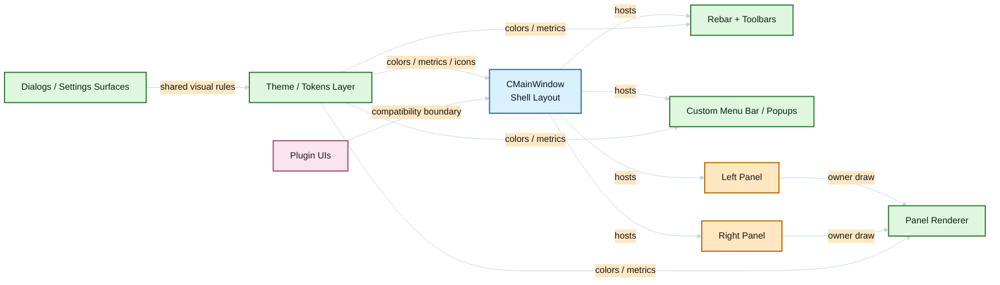
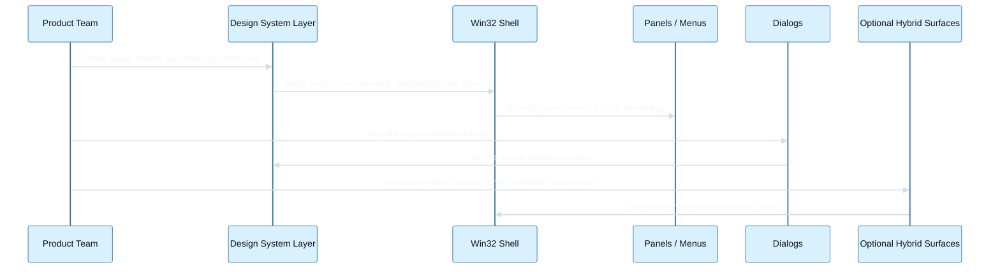

# UI Modernization Paths

## Current UI Reality

The current shell is not a typical dialog-driven app. It is a custom Win32 shell composed of:

- a rebar-driven top area created in `src/mainwnd3.cpp`
- a global layout engine in `src/mainwnd1.cpp`
- custom-painted popup menus and menu bar in `src/menu.h`
- custom-painted two-panel file surfaces in `src/fileswnd.h` and `src/fileswn4.cpp`
- multiple toolbar and status surfaces refreshed through `OnColorsChanged()` and related routines

That means any "modern UI" path must respect one core fact: the most important surfaces are not isolated forms that can be swapped cheaply. They are part of the shell's structural code.

## Communication Diagram

## Sequence Diagram

## Modernization Principles

- preserve the two-panel identity and fast keyboard workflow
- modernize the shell by layers, not by random one-off repaints
- prioritize consistency over novelty
- keep plugin compatibility as a hard boundary in early phases
- separate visual system work from shell rewrite decisions

## Paths

## Path A: Visual Refresh In Place

### What it means

Keep the current Win32 shell and modernize only the visible treatment:

- spacing, paddings, separators, panel headers, status strips
- toolbar and rebar density
- menu colors and hover states
- icon refresh and typography cleanup
- focus, selection, and active-panel state cleanup
- selected dialogs restyled without changing shell architecture

### Pros

- fastest path to visible improvement
- lowest shell risk
- compatible with current code structure
- can ship in small slices

### Cons

- does not fix deep coupling
- dark mode and future feature surfaces remain expensive
- some visual debt stays because custom components keep their current architecture

### When to choose it

Choose this if the goal is a better-looking Salamander quickly, without introducing substantial architectural change in the first wave.

## Path B: Incremental Shell Modernization On Current Win32 Host

### What it means

Keep the app as a Win32 shell, but create a proper UI modernization layer:

- introduce shared visual tokens for colors, metrics, typography, and icon sizing
- refactor shell surfaces to consume centralized theme/layout rules
- standardize menu, toolbar, panel header, status, and dialog visuals
- isolate reusable shell services for command state, theme state, and surface metrics
- progressively modernize high-traffic dialogs and optional side surfaces

### Pros

- best balance between value and realism for this repo
- creates a real foundation for dark mode, DPI cleanup, and future features
- preserves startup model, plugin model, and existing shell ownership
- lets us improve architecture where UI changes actually need it

### Cons

- slower than a pure visual skin pass
- requires disciplined refactoring around highly coupled shell code
- still leaves plugin UIs partially heterogeneous

### When to choose it

Choose this if the goal is a genuinely more modern product without paying full rewrite cost.

## Path C: Hybrid Modern Surfaces Inside The Existing Shell

### What it means

Keep the Win32 shell, but introduce bounded modern surfaces for selected areas, for example:

- settings experience
- onboarding or start page
- rich file preview or information pane
- operation center or transfer dashboard

Potential technologies include XAML Islands, WinUI-hosted surfaces, or another embedded UI runtime, but only behind narrow integration points.

### Pros

- enables visibly modern surfaces where standard Win32 feels limiting
- avoids rewriting the whole shell
- good fit for isolated flows that are not the main two-panel surface

### Cons

- interop, deployment, focus, accessibility, and theming complexity go up fast
- visual mismatch is likely unless Path A or B already established a strong visual system
- not a good first move for the main file panels

### When to choose it

Choose this only after the shell already has a coherent visual foundation and there is a strong isolated use case.

## Path D: Full Shell Rewrite After Core Extraction

### What it means

Extract command, navigation, operations, and plugin orchestration into a cleaner core boundary and rebuild the shell in a modern UI stack.

### Pros

- highest long-term freedom
- easiest path to deep UX changes if successful
- could simplify later UI work once the core boundary exists

### Cons

- highest cost and schedule risk by far
- plugin integration, shell behavior parity, and keyboard parity become major program risks
- likely requires multi-phase coexistence or long-lived branch strategy
- easy to underestimate and stall

### When to choose it

Choose this only if product goals clearly exceed what the current shell can reasonably evolve into and the team accepts a program-scale investment.

## Comparison Matrix

| Path | User-visible impact | Engineering risk | Time to first value | Long-term flexibility | Fit for current codebase |
| --- | --- | --- | --- | --- | --- |
| A. Visual refresh in place | Medium | Low | Fast | Low to medium | High |
| B. Incremental shell modernization | High | Medium | Medium | High | High |
| C. Hybrid modern surfaces | Medium to high | Medium to high | Medium | Medium to high | Medium |
| D. Full shell rewrite | Very high | Very high | Slow | Very high | Low in short term |

## Recommended Path

The strongest recommendation is:

1. start with Path A as a short foundation wave
2. immediately structure the work as Path B, not as isolated skinning
3. use Path C only for isolated surfaces after the shell has a coherent visual system
4. defer Path D unless product goals later justify a rewrite program

In practical terms, that means:

- do not begin with WinUI or a full rewrite
- do not start by repainting isolated dialogs without a token system
- first create a shell-wide modernization language that the current Win32 host can consume
- then modernize the most visible surfaces in the shell itself

## Suggested Delivery Phases

### Phase 0: UI Foundation

- define visual tokens for colors, spacing, typography, icon sizes, borders, and state colors
- define modern active/inactive, hover, focus, and selection rules
- define which surfaces remain native and which are owner-drawn

### Phase 1: Shell Chrome

- refresh menu bar, popup menus, toolbars, split lines, panel headers, and status areas
- reduce visual noise and inconsistent beveling
- align spacing and iconography

### Phase 2: Panels

- modernize panel headers, row states, focus treatment, quick search/rename visuals, and optional side surfaces
- improve contrast and readability before attempting deeper UX changes

### Phase 3: Dialogs And Settings

- migrate the highest-friction dialogs first
- create a more modern settings experience without breaking existing configuration structure

### Phase 4: Optional Hybrid Surfaces

- only after the shell foundation is coherent
- target isolated surfaces such as richer preview, dashboard, or onboarding

## Architectural Risks

- custom menu and panel rendering make broad visual changes more invasive than they first appear
- plugin windows will visually lag unless a compatibility strategy is defined
- dark mode should not be attempted as scattered color swaps
- DPI and font metric changes can ripple through manual layout code
- a rewrite temptation can derail incremental value if the scope is not controlled

## Decision Gate

Before implementation starts, decide:

- whether the first milestone is strictly visual or already includes shell refactoring hooks
- which surfaces are mandatory in wave one: menu, toolbar, panel chrome, dialogs, or all of them
- whether a theme token layer will be treated as required infrastructure
- whether hybrid surfaces are in scope for the first program year
